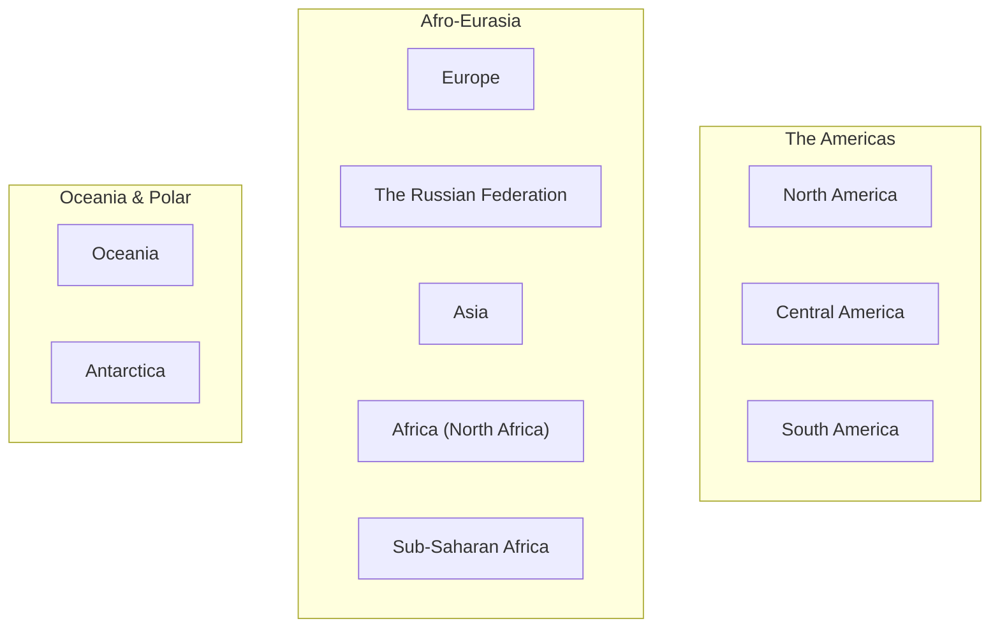

# AP Human Geography: World Regions Master Study Guide
**Target Assessment**: World Regions Map Formative Quiz (Mrs. Anne Knight • Room 1325)  
**Curriculum Coordinates**: AMSCO *Human Geography: AP Edition (2nd Edition by David Palmer)*, Topic 1.7, Pages 44–45  
**Permanent Location**: `/Volumes/Backup/Antony/HighSchool/Grade9/HumanGeography/StudyMaterials/ExamsMaterials/01-set/studyGuide/world-regions/`

---

## 0. Assessment Scope & Grading Reality

- **Category**: Formative Assessment (counts toward the **25% formative grade weight** in Forsyth County Schools).
- **Core Skill Tested**: Scale of Analysis and Regional Classification (College Board CED Unit 1: *Thinking Geographically*, Skill 2.A & 2.B).
- **Format**:
  1. **Map 1: A Big Picture View** (10 Macro-Regions + 5 Oceans)
  2. **Map 2: A Closer Look** (23 Specific Subregions)

---

## 1. Map 1: A Big Picture View (10 Macro-Regions & 5 Oceans)

According to AMSCO page 44, geographers establish large world regions based on physical continents combined with shared cultural and linguistic histories.



### The 10 Macro-Regions

| # | Region Name on Map | Definition & Distinguishing Characteristics | Key AP Anchor Points |
| :-: | :--- | :--- | :--- |
| **1** | **North America** | Canada, United States, and Greenland. Anglo-American cultural sphere influenced predominantly by British/French heritage. | Do NOT include Mexico here on the AP map (Mexico begins Latin America). |
| **2** | **Central America** | Narrow isthmus linking North & South America (Guatemala to Panama). Culturally Latin/Spanish heritage. | Physically part of the North American continent, but culturally Latin America. |
| **3** | **South America** | Continent south of Panama (Colombia to Chile/Argentina). | Dominated by Spanish language and Roman Catholic faith, except Portuguese Brazil. |
| **4** | **Europe** | Eurasian landmass west of the Ural Mountains and Black Sea. | Highly developed, industrialized, Post-Industrial (DTM Stage 4 & 5). |
| **5** | **The Russian Federation** | Massive transcontinental state spanning Eastern Europe and Northern Asia (Siberia). | Spans 11 time zones; separates Europe from East Asia. |
| **6** | **Asia** | Largest continent, bounded by the Arctic, Pacific, and Indian Oceans. | High internal diversity; contains over 60% of the human population. |
| **7** | **Africa** *(or North Africa)* | Arid zone north of the Sahara desert, culturally linked to Southwest Asia. | Predominantly Arabic-speaking and Islamic. |
| **8** | **Sub-Saharan Africa** | The entire African landmass south of the Sahara desert. | Distinct cultural, linguistic (Niger-Congo), and demographic realm (high TFR). |
| **9** | **Oceania** | Australia, New Zealand, and thousands of Pacific island chains. | Encompasses Melanesia, Micronesia, and Polynesia. |
| **10** | **Antarctica** | Southern polar continent covered by continental glaciers. | Governed by the Antarctic Treaty; no permanent sovereign human settlements. |

### The 5 Oceans

1. **Arctic Ocean**: Encircles the North Pole; borders Canada, Alaska, Russia, and Scandinavia.
2. **Atlantic Ocean**: S-shaped basin separating the Americas from Europe and Africa.
3. **Pacific Ocean**: Largest and deepest ocean; bordered by the "Ring of Fire".
4. **Indian Ocean**: Located between Africa, the Indian Subcontinent, and Australia.
5. **Southern Ocean**: Encircles Antarctica south of 60°S latitude.

---

## 2. Map 2: A Closer Look (The 23 Tested Subregions)

When changing scale from global to regional ("A Closer Look", AMSCO p. 45), regions are split into subregions based on more specific physical and cultural traits.

```
                           +---------------------------+
                           |          RUSSIA           |
+--------------------------+-------------+-------------+--------------------------+
|      WESTERN EUROPE      | EASTERN EUR | CENTRAL ASIA|         EAST ASIA        |
+--------------------------+-------------+-------------+--------------------------+
|       NORTH AFRICA       | MIDDLE EAST |  SOUTH ASIA |      SOUTHEAST ASIA      |
+--------------------------+-------------+-------------+--------------------------+
|       WEST AFRICA        | CENT AFRICA | EAST AFRICA |        MICRONESIA        |
+--------------------------+-------------+-------------+--------------------------+
|     SOUTHERN AFRICA      |             |  AUSTRALIA  |   MELANESIA / POLYNESIA  |
+--------------------------+-------------+-------------+--------------------------+
```

### Complete Subregions Directory & Master Key

| Coordinate Region | Larger Realm | Constituent Countries / Geographic Landmarks | High-Yield AP Exam Memory Cue |
| :--- | :---: | :--- | :--- |
| **1. Canada** | North America | Canada (Provinces & Arctic Territories) | Northern half of North America; bilingual English/French (Quebec). |
| **2. United States** | North America | Lower 48 States + Alaska + Hawaii | Economic superpower; high immigration destination. |
| **3. Latin America** *(or Mexico)* | Americas | Mexico, Central America, South America | Spanish/Portuguese language, Roman Catholicism. |
| **4. Caribbean** | Americas | Cuba, Haiti, Dominican Republic, Jamaica, Bahamas, Puerto Rico | Island nations in the Caribbean Sea; plantation agricultural history. |
| **5. Brazil** | Latin America | Brazil (Amazon Basin & Atlantic Coast) | **Unique Language Trap**: Unlike Spanish Latin America, Brazil speaks **Portuguese**. |
| **6. Western Europe** | Europe | UK, France, Germany, Spain, Italy, Low Countries, Scandinavia | NATO/EU core, post-industrial economies, Stage 4/5 DTM. |
| **7. Eastern Europe** | Europe | Poland, Ukraine, Romania, Czechia, Hungary, Balkans, Baltics | Historical Soviet bloc/Warsaw Pact influence, Slavic languages. |
| **8. Russia** | Eurasia | Russian Federation (European Russia & Siberia) | Transcontinental Eurasian powerhouse, Ural Mountain divide. |
| **9. Central Asia** | Asia | Kazakhstan, Uzbekistan, Turkmenistan, Kyrgyzstan, Tajikistan | Landlocked post-Soviet "-stan" republics; arid steppes and silk roads. |
| **10. Middle East** *(Southwest Asia)* | Asia/Africa | Saudi Arabia, Iran, Iraq, Israel, Turkey, Syria, Jordan, UAE | Arid climate, crossroads of 3 continents, birthplace of Abrahamic faiths. |
| **11. South Asia** | Asia | India, Pakistan, Bangladesh, Nepal, Bhutan, Sri Lanka | Indian Subcontinent, Himalayan barrier, monsoon climate, high population. |
| **12. East Asia** | Asia | China, Japan, North Korea, South Korea, Taiwan, Mongolia | Sinosphere, Confucian tradition, massive manufacturing and Stage 5 aging. |
| **13. Southeast Asia** | Asia | Vietnam, Thailand, Indonesia, Philippines, Malaysia, Myanmar, Singapore | Indochinese Peninsula + Malay Archipelago; maritime shipping choke points. |
| **14. North Africa** | Africa | Egypt, Libya, Algeria, Tunisia, Morocco, Sudan | Sahara desert; Arabic language and Islam link it to the Middle East. |
| **15. West Africa** | Sub-Saharan Africa | Nigeria, Ghana, Senegal, Ivory Coast, Mali, Niger, Burkina Faso | Atlantic bulge around Gulf of Guinea; highest population in Africa. |
| **16. Central Africa** | Sub-Saharan Africa | DR Congo, Rep of Congo, Cameroon, Gabon, Chad, CAR | Equatorial Congo River rainforest basin; rich in mineral resources. |
| **17. East Africa** | Sub-Saharan Africa | Kenya, Ethiopia, Tanzania, Uganda, Rwanda, Somalia | Great Rift Valley, African Great Lakes, Swahili coast, Horn of Africa. |
| **18. Southern Africa** | Sub-Saharan Africa | South Africa, Zimbabwe, Botswana, Namibia, Mozambique, Zambia | Mineral wealth (diamonds, gold), Kalahari Desert, temperate southern veld. |
| **19. Australia** | Oceania | Commonwealth of Australia | Continental landmass, Outback arid interior, coastal urban clusters. |
| **20. Micronesia** | Oceania | Marshall Islands, Federated States of Micronesia, Palau, Guam | "Small islands" north of Melanesia and east of the Philippines. |
| **21. Melanesia** | Oceania | Papua New Guinea, Fiji, Solomon Islands, Vanuatu, New Caledonia | "Black islands" directly north and northeast of Australia. |
| **22. Polynesia (North/East)** | Oceania | Hawaii, Tuvalu, Kiribati, Cook Islands, French Polynesia | "Many islands" forming a massive triangle from Hawaii to New Zealand. |
| **23. Polynesia (South/West)** | Oceania | New Zealand, Samoa, Tonga | South/West corner of the Polynesian Triangle. |

---

## 3. Deep Focus 1: Southeast Asia vs. East Asia

### The Boundary Line
- **Physical Boundary**: The southern political border of China (Yunnan and Guangxi provinces) and the Tonkin Gulf.
- **East Asia Stops At**: The southern border of China.
- **Southeast Asia Starts At**: The northern borders of **Myanmar (Burma), Laos, and Vietnam**.

### Contrast Analysis

| Dimension | **East Asia** | **Southeast Asia** |
| :--- | :--- | :--- |
| **Geography** | Solid continental mainland + offshore islands (Japan, Taiwan) | Split into **Mainland Indochina** and **Maritime Archipelago** (Indonesia = 17,000+ islands) |
| **Dominant Faiths** | Buddhism, Taoism, Confucianism, Shinto | Theravada Buddhism (mainland), Islam (Indonesia, Malaysia), Catholicism (Philippines) |
| **Demographics** | Extreme low birth rates, shrinking population (Japan, S. Korea $TFR \approx 0.72$) | Moderate to developing growth; transition from Stage 3 to 4 |
| **Strategic Chokepoint** | Taiwan Strait | **Strait of Malacca** (between Malaysia, Indonesia, Singapore) |

> [!WARNING]
> **AP Trap**: Do NOT place **Vietnam** in East Asia! Even though Vietnamese culture was heavily influenced by Chinese Confucianism and dynasties, geographers strictly classify Vietnam as **Southeast Asia** based on its physical location in the Indochinese Peninsula.

---

## 4. Deep Focus 2: Central Asia vs. South Asia

### The Boundary Line
- **The Great Mountain Wall**: The **Himalayan Mountain Range**, Karakoram, and Hindu Kush create the most formidable natural barrier on Earth.
- **North of the Mountains**: Arid, high-altitude steppes and cold deserts = **Central Asia**.
- **South of the Mountains**: Warm, monsoon-fed alluvial river valleys (Indus, Ganges, Brahmaputra) = **South Asia**.

### Contrast Analysis

| Dimension | **Central Asia** | **South Asia** |
| :--- | :--- | :--- |
| **The "-stan" Factor** | *Kazakhstan, Uzbekistan, Turkmenistan, Kyrgyzstan, Tajikistan* | **Pakistan** is the ONLY South Asian country ending in "-stan" |
| **Historical Alignment** | Former Soviet Union republics; Russian language widely spoken | British colonial empire (British Raj); English widely spoken as lingua franca |
| **Population Density** | Very low arithmetic density (vast empty desert and steppe) | Extreme physiological and arithmetic density (over 1.8 billion people) |
| **Religions** | Predominantly Sunni Muslim | Hinduism (India, Nepal), Islam (Pakistan, Bangladesh), Buddhism (Bhutan, Sri Lanka) |

> [!CAUTION]
> **The Pakistan Trap**: Students see the suffix "-stan" and mistakenly label Pakistan as Central Asia. **Pakistan is 100% SOUTH ASIA**. It lies directly in the Indus River Valley on the Indian Subcontinent.

---

## 5. Deep Focus 3: Sub-Saharan Africa Quadrants

Sub-Saharan Africa is subdivided into 4 balanced geographic quadrants:

```
        NORTH AFRICA (Above Sahara)
---------------------------------------------
[WEST AFRICA]      [CENTRAL AFRICA]    [EAST AFRICA]
Bulge on Atlantic  Congo Rainforest    Horn & Great Lakes
(Nigeria, Ghana)   (DRC, Cameroon)     (Kenya, Ethiopia)
---------------------------------------------
             [SOUTHERN AFRICA]
          Bottom Cape & Kalahari
          (South Africa, Botswana)
```

1. **West Africa (The Atlantic Bulge)**:
   - *Anchor Country*: **Nigeria** (Africa's most populous nation, over 220 million people).
   - *Key Trait*: Lies along the coast of the Gulf of Guinea. Historic origin of transatlantic slave trade.
2. **Central Africa (The Equatorial Core)**:
   - *Anchor Country*: **Democratic Republic of the Congo (DRC)**.
   - *Key Trait*: Sits directly across the Equator. Dominated by the Congo Basin tropical rainforest. High physiological density near rivers.
3. **East Africa (The Horn & Rift Valley)**:
   - *Anchor Countries*: **Ethiopia**, **Kenya**, Tanzania, Uganda.
   - *Key Trait*: Plateaus, volcanic soil, the Great Rift Valley, Mount Kilimanjaro, and the Swahili coast along the Indian Ocean.
4. **Southern Africa (The Southern Cone)**:
   - *Anchor Country*: **South Africa**.
   - *Key Trait*: Temperate southern plateau, Kalahari Desert, rich in mineral deposits (gold, platinum, diamonds).

---

## 6. The Top 5 College Board & Mrs. Knight Map Traps

1. **The Brazil Language Trap**:
   - *Question*: Why is Brazil categorized as a separate subregion in Latin America?
   - *Answer*: Because Brazil’s official language is **Portuguese**, whereas the rest of Latin America is predominantly Spanish-speaking.
2. **The Middle East / North Africa Dual Identity**:
   - *Question*: Why are North Africa and Southwest Asia frequently grouped together?
   - *Answer*: They share the **Arabic language**, the **Islamic faith**, and an arid/semi-arid climate, despite being on two different physical continents.
3. **The Oceania Island Triad**:
   - **Micronesia** = *Micro* (small) islands north of the equator.
   - **Melanesia** = *Melan* (dark) islands south of the equator, north/east of Australia.
   - **Polynesia** = *Poly* (many) islands forming the massive triangle between Hawaii, New Zealand, and Easter Island.
4. **The Scale of Analysis Principle (AMSCO p. 45)**:
   - Moving from *A Big Picture View* (10 regions) to *A Closer Look* (23 subregions) represents a **change in scale of analysis (zooming in)**, which reveals internal cultural and economic variation masked at global scales.
5. **Formal vs. Perceptual Regional Boundaries**:
   - Formal regions (like countries) have precise legal boundaries.
   - Perceptual/Vernacular regions (like "The Middle East" or "The American South") have **fuzzy, debatable transition zones**.

---

## 7. 15-Question Rapid Self-Test Simulation

*Cover the answers column and test your recall!*

| # | Question Prompt | Correct Answer | Key Rationale |
| :-: | :--- | :--- | :--- |
| **1** | Which subregion includes Kazakhstan and Uzbekistan? | **Central Asia** | Landlocked former Soviet republics north of the Himalayas. |
| **2** | Which subregion includes Pakistan and Bangladesh? | **South Asia** | Part of the Indian Subcontinent south of the Himalayas. |
| **3** | To which subregion does Vietnam belong? | **Southeast Asia** | Located on the Indochinese Peninsula, south of China. |
| **4** | What physical barrier separates Central Asia from South Asia? | **The Himalayas / Hindu Kush** | Massive mountain wall that blocks continental weather and movement. |
| **5** | In which subregion of Africa is Nigeria located? | **West Africa** | Located on the Gulf of Guinea on the western bulge. |
| **6** | In which subregion of Africa is the Democratic Republic of the Congo located? | **Central Africa** | Equatorial heartland dominated by the Congo River rainforest. |
| **7** | Which African subregion contains Kenya and Ethiopia? | **East Africa** | The Horn of Africa and Great Rift Valley region. |
| **8** | Why is Brazil treated as a distinct subregion within Latin America? | **Portuguese language** | Culturally distinct from the surrounding Spanish-speaking states. |
| **9** | Which Pacific subregion includes Hawaii and New Zealand? | **Polynesia** | Forms the vertices of the Polynesian cultural triangle. |
| **10** | Which island subregion is located directly north of Australia and includes Papua New Guinea? | **Melanesia** | The southwestern Pacific chain north of Australia. |
| **11** | What term describes regions defined by people's informal feelings, like "The Middle East"? | **Perceptual / Vernacular region** | Defined by cultural perception rather than precise legal borders. |
| **12** | Which ocean lies between Africa, South Asia, and Australia? | **Indian Ocean** | Warm tropical ocean basin. |
| **13** | Which macro-region on the Big Picture map spans 11 time zones across Europe and Asia? | **The Russian Federation** | Transcontinental federation spanning both continents. |
| **14** | Is Mexico part of North America or Latin America on the AP subregions map? | **Latin America** | Culturally Latin American, grouped south of the US border. |
| **15** | What geographic concept is illustrated when moving from 10 macro regions to 23 subregions? | **Scale of Analysis / Regional Disaggregation** | Zooming in reveals internal diversity that global views hide. |
